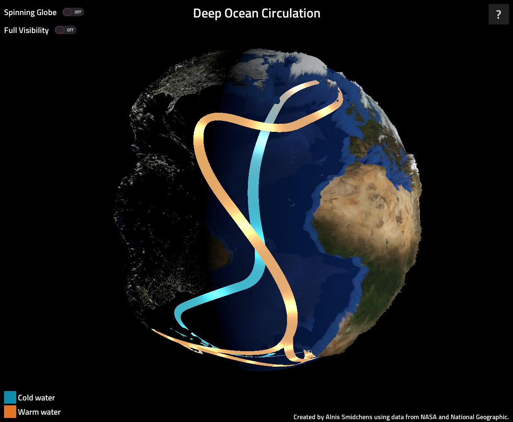

# What is this project?
This is a visualization of deep ocean circulation on Earth.

Launch in your browser: https://pasaules-skati.netlify.app/

Itch page (download & in-browser): https://alnis.itch.io/deep-ocean-circulation

<strong>Controls: Click and drag to rotate the view.</strong>

# What is deep ocean circulation?

Deep ocean circulation is the movement of water deep under the ocean's surface.

It is driven by sinking water near Greenland and Antarctica during the winter, when the water is especially cold and salty causing it to be dense enough to sink. Such circulation is very slow, with water taking 1,200 years to cycle from the North Atlantic to the Pacific and back.

# How does this project work?
Topographic, bathymetric, and light maps from NASA are merged with a circulation map from the National Geographic Society to produce the globe. Rendering is done through custom shaders.

This project is inspired by a physical model from the Ocean 200 class taught at UW, and created & published in approximately 8 hours for the Spring 2022 EverybodyHacks hackathon at UW.

Created by Alnis Smidchens using the Godot game engine.
* GitHub: AlnisS/pasaules-skati
* Email: [contact@alnis.dev](mailto:contact@alnis.dev)
* [Instagram](https://www.instagram.com/auxiliarymoose/)/[Twitter](https://twitter.com/auxiliarymoose)/[Reddit](https://www.reddit.com/user/auxiliarymoose): @auxiliarymoose
